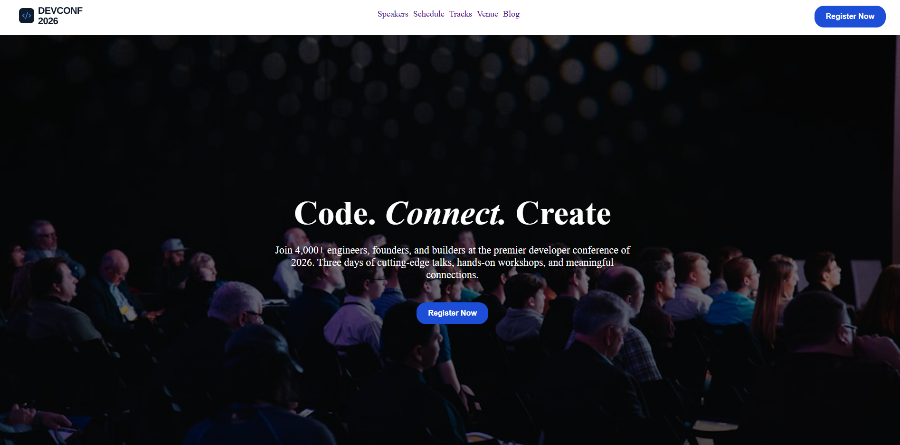

# 💻 DevConf 2026 — Landing Page

A modern and responsive landing page designed for **DevConf 2026**, a fictional developer conference bringing together engineers, founders, and builders.

The website includes conference speakers, ticket pricing plans, sponsors, a hero section, navigation, and a footer with social media links.

## 🌐 Live Demo

🔗 [View Live Website](https://assignment-1-lovat-alpha.vercel.app/)

## 📸 Project Preview



## 🛠️ Technologies Used

* HTML5
* CSS3
* Font Awesome 6.7.2

## ✨ Main Features

* 🎯 Modern DevConf 2026 landing page
* 📱 Responsive layout
* 🧭 Navigation bar with conference sections
* 🚀 Hero section with call-to-action button
* 👨‍💻 Meet the Speakers section
* 🎫 Conference pricing plans
* 🏢 Sponsors section
* 📱 Social media icon integration
* 🎨 Modern card-based UI
* ✨ Hover effects on buttons and sponsor cards
* 🖼️ Local image assets

## 📋 Website Sections

### Navigation

Includes links for:

* Speakers
* Schedule
* Tracks
* Venue
* Blog
* Register Now

### Hero Section

Introduces DevConf 2026 with a large headline, conference description, and registration call-to-action.

### Speakers

Features four conference speakers across different technology tracks:

* AI / ML
* Cloud & DevOps
* Frontend
* Security

### Pricing

Three ticket plans are displayed:

* Standard — $399
* Pro — $749
* Team — $5999

### Sponsors

The page highlights:

* Google
* GitHub
* Microsoft
* Netflix

### Footer

Includes the DevConf branding, social media icon, and copyright information.

## 📦 Dependencies

This project does not require Node.js, npm, or any package installation.

The project uses the following external resource:

**Font Awesome 6.7.2**

```html
https://cdnjs.cloudflare.com/ajax/libs/font-awesome/6.7.2/css/all.min.css
```

All other files are written using standard HTML and CSS.

## 💻 How to Run Locally

### 1. Clone the repository

```bash
git clone https://github.com/mohammadmuqtadialsaadi-alt/assignment-1.git
```

### 2. Open the project folder

```bash
cd assignment-1
```

### 3. Run the project

Open the `index.html` file in your web browser.

You can also use **VS Code with Live Server** if you have the Live Server extension installed.

No `npm install` or build command is required.

## 📁 Project Structure

```text
assignment-1/
├── assets/
│   ├── logo.png
│   ├── footer-logo.png
│   ├── banner.jpg
│   ├── andrej.png
│   ├── demis.png
│   ├── gary.png
│   ├── mustafa.png
│   └── ...
├── index.html
├── style.css
├── prompts.md
└── README.md
```

## 🔗 Relevant Links

* 🌐 [Live Demo](https://assignment-1-lovat-alpha.vercel.app/)
* 💻 [GitHub Repository](https://github.com/mohammadmuqtadialsaadi-alt/assignment-1)

## 👨‍💻 Author

**Mohammad Muqtadi Al Saadi**

* GitHub: [@mohammadmuqtadialsaadi-alt](https://github.com/mohammadmuqtadialsaadi-alt)

---

⭐ If you like this project, feel free to star the repository!
